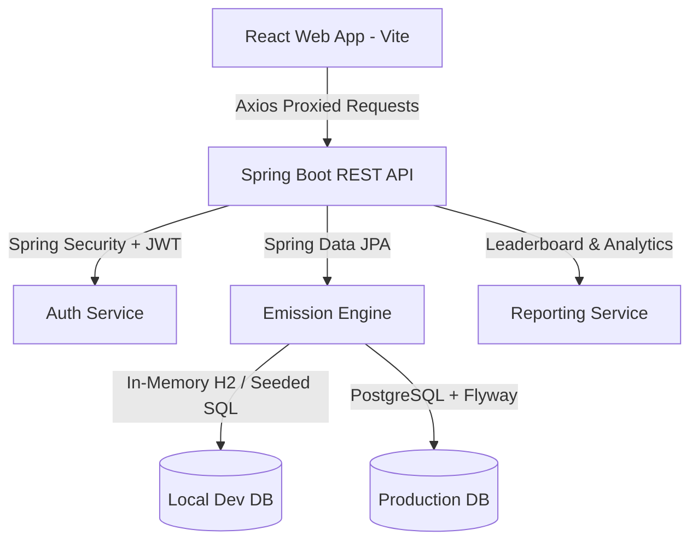

# 🍀 CarbonTrack

CarbonTrack is a modern, full-stack application designed to help individuals and organizations calculate, log, and reduce their carbon footprint. By analyzing daily activities—such as transit choices, dining habits, shopping, and electricity usage—CarbonTrack calculates precise CO₂ equivalents ($CO_2e$) and offers actionable insights, custom reduction goals, leaderboard rankings, and gamified badge achievements to encourage sustainable habits.

---

## 🚀 Tech Stack

### Frontend
*   **Core Framework**: [React 18](https://react.dev/) (built with [Vite](https://vite.dev/))
*   **Styling**: [Tailwind CSS v4](https://tailwindcss.com/) (using `@tailwindcss/vite` plugin for lightning-fast builds)
*   **Routing**: [React Router DOM v6](https://reactrouter.com/)
*   **Data Visualization**: [Recharts](https://recharts.org/) (interactive area, bar, and pie charts for carbon analytics)
*   **Form Management**: [React Hook Form](https://react-hook-form.com/)
*   **API Client**: [Axios](https://axios-http.com/)
*   **UI Components & Notifications**: [React Icons](https://react-icons.github.io/react-icons/) & [React Toastify](https://fkhadra.github.io/react-toastify/)

### Backend
*   **Language & Runtime**: [Java 17](https://www.oracle.com/java/technologies/downloads/)
*   **Framework**: [Spring Boot 3.3.4](https://spring.io/projects/spring-boot)
*   **Security**: [Spring Security](https://spring.io/projects/spring-security) with stateless **JWT Authentication** + **OAuth2 Google Login client support**
*   **ORM / Database Access**: [Spring Data JPA](https://spring.io/projects/spring-data-jpa) (Hibernate)
*   **Database Management**:
    *   **PostgreSQL**: Production/Staging database
    *   **H2 Database**: Fast in-memory database for local/development (`local` profile)
    *   **Flyway Database Migrations**: Automated versioned schema management
*   **API Documentation**: [Springdoc OpenAPI v2 / Swagger UI](https://springdoc.org/)
*   **Utilities**: [Lombok](https://projectlombok.org/) (boilerplate reduction)

---

## 🎨 System Architecture & Features



1.  **User Profiles & Organization Support**: Users can choose preferred unit systems (Metric vs. Imperial) and join Organizations to collaborate on collective reduction targets.
2.  **Emission Calculation Engine**: Computes exact footprint using category-specific active emission factors (sourced from EPA 2024 and IPCC AR6) across categories:
    *   **Transport**: Petrol/diesel/electric cars, short/long-haul flights, public transit (bus/rail).
    *   **Electricity**: Grid electricity vs. renewable sources.
    *   **Food**: Beef, chicken, vegetarian, and vegan meals.
    *   **Shopping**: Clothing, electronics, general retail.
3.  **Analytics & Visualizations**: Interactive dashboards detailing historical emission trends, distribution across categories, and streak counts.
4.  **Goals Tracking**: Users set personalized target carbon reductions, tracking progress dynamically with visual progression charts.
5.  **Gamification & Achievements**: Core badge engine awarding badges (e.g., *Green Commuter* streak badge, *First Step*, *Carbon Saver* tiers) based on user activity triggers and reductions.
6.  **Interactive API Docs**: Fully interactive Swagger interface showcasing all controller endpoints, request bodies, schemas, and authentication flows.

---

## 📁 Repository Structure

```
carbontrack/
├── backend/                   # Spring Boot Java application
│   ├── .mvn/                  # Maven Wrapper settings
│   ├── mvnw / mvnw.cmd        # Maven Wrapper execution scripts
│   ├── pom.xml                # Backend dependencies and Maven configuration
│   └── src/
│       ├── main/
│       │   ├── java/com/team7/carbontrack/
│       │   │   ├── config/        # App & Security Configurations
│       │   │   ├── controller/    # REST API Controllers (endpoints)
│       │   │   ├── dto/           # Data Transfer Objects
│       │   │   ├── entity/        # JPA Entities (User, ActivityLog, Goal, etc.)
│       │   │   ├── exception/     # Global Error Handlers & Custom Exceptions
│       │   │   ├── repository/    # JPA Repositories
│       │   │   ├── security/      # JWT filter, User Details service, OAuth2 configs
│       │   │   └── service/       # Business Logic Services
│       │   └── resources/
│       │       ├── db/migration/  # Flyway DB schema migration scripts
│       │       ├── application.yml# Base configuration
│       │       ├── application-local.yml # H2-specific local development profile
│       │       └── dev-data.sql   # Local database seeding scripts
│       └── test/                  # Unit and integration test suites
│
├── frontend/                  # React Vite Single Page Application (SPA)
│   ├── index.html             # Main entry HTML
│   ├── package.json           # Frontend scripts & dependencies
│   ├── vite.config.js         # Vite dev-server config & API proxies
│   └── src/
│       ├── api/               # API clients & Axios interceptors
│       ├── components/        # Shared components (Navbar, Sidebar, Charts, Cards)
│       ├── context/           # React Auth and Theme context providers
│       ├── layouts/           # Common layouts (Auth layout, Dashboard layout)
│       ├── pages/             # Route views (Dashboard, Profile, LogActivity, Leaderboard)
│       ├── routes/            # Route configurations (Private vs Public routes)
│       ├── services/          # Client-side API request functions
│       └── index.css          # Main entry styling (Tailwind CSS directives)
```

---

## ⚙️ Setup & Running Locally

### Prerequisites
*   **Java**: JDK 17 installed and configured.
*   **Node.js**: Node 18+ and `npm` installed.
*   **IDE**: IntelliJ IDEA (recommended for backend) and VS Code (recommended for frontend), or similar.

---

### Step 1: Run the Backend

By default, the backend runs in a **`local` development profile** which uses an **in-memory H2 database**. It will automatically spin up, generate the schema from JPA definitions, and seed it with dummy emission factors and test badges using `dev-data.sql`. No PostgreSQL installation is required for local testing!

1.  Navigate to the backend directory:
    ```bash
    cd backend
    ```
2.  Start the Spring Boot application using the Maven wrapper, activating the `local` profile:
    *   **Windows (PowerShell/CMD)**:
        ```powershell
        .\mvnw.cmd spring-boot:run -Dspring-boot.run.profiles=local
        ```
    *   **Linux / macOS**:
        ```bash
        ./mvnw spring-boot:run -Dspring-boot.run.profiles=local
        ```
3.  The backend will start on port **`8081`**.
    *   **OpenAPI Documentation**: [http://localhost:8081/swagger-ui.html](http://localhost:8081/swagger-ui.html)
    *   **H2 Database Console**: [http://localhost:8081/h2-console](http://localhost:8081/h2-console) (JDBC URL: `jdbc:h2:mem:carbontrack`, Username: `sa`, Password: *blank*).

---

### Step 2: Run the Frontend

The React frontend uses Vite's built-in development server configuration with a proxy. Any request to `/api` or `/oauth2` will be automatically proxied to the backend running at `http://localhost:8081`.

1.  Navigate to the frontend directory:
    ```bash
    cd frontend
    ```
2.  Install packages:
    ```bash
    npm install
    ```
3.  Run the local development server:
    ```bash
    npm run dev
    ```
4.  Open your browser and navigate to **`http://localhost:5173`**.

---

## 🌐 Production Environment Configurations

To connect to a live environment (e.g. PostgreSQL in production or staging) instead of the in-memory H2 database, run the Spring Boot app **without** the `-Dspring-boot.run.profiles=local` flag. Provide the database coordinates via environment variables.

### Environment Variables

| Variable | Description | Default (if omitted) |
| :--- | :--- | :--- |
| `DB_HOST` | Hostname of the PostgreSQL server | `localhost` |
| `DB_PORT` | Port of the PostgreSQL server | `5432` |
| `DB_NAME` | Database name | `carbontrack` |
| `DB_USERNAME` | Database username | `carbontrack` |
| `DB_PASSWORD` | Database password | `carbontrack` |
| `JWT_SECRET` | HMAC-SHA256 Base64-encoded secret for signing tokens | *Default dev secret* |
| `SERVER_PORT` | Port for the backend API | `8081` |
| `GOOGLE_CLIENT_ID` | OAuth2 Google registration client identifier | *Blank (disabled)* |
| `GOOGLE_CLIENT_SECRET`| OAuth2 Google client secret key | *Blank (disabled)* |

> [!IMPORTANT]
> When running with the default profile (non-local), Flyway migrations are active. Flyway will execute scripts in `resources/db/migration` to create and update tables incrementally. Ensure your database user has permission to create tables, indexes, and write to schema tables.

---

## 📊 Database Migrations (Flyway)

To add new tables or alter schemas in production/non-local environments, append a new sql script inside the `backend/src/main/resources/db/migration/` directory using the name format:
`V<version_number>__<description>.sql` (e.g. `V10__add_new_rewards_table.sql`).
On application startup, Flyway compares local migration versions against the database metadata table `flyway_schema_history` and executes any new migrations.
