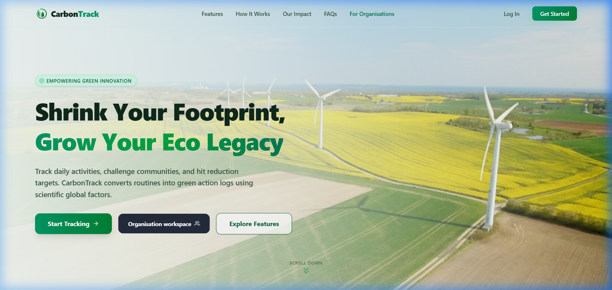
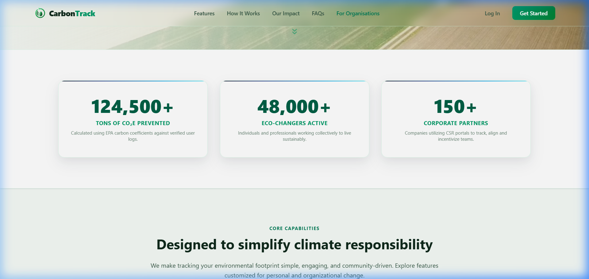
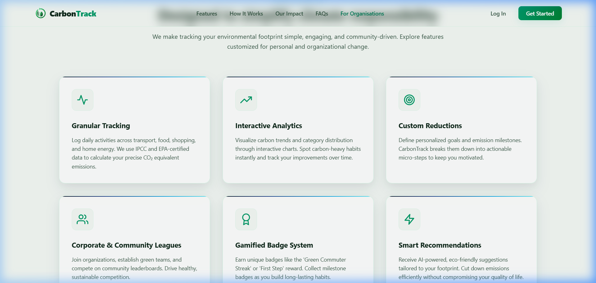
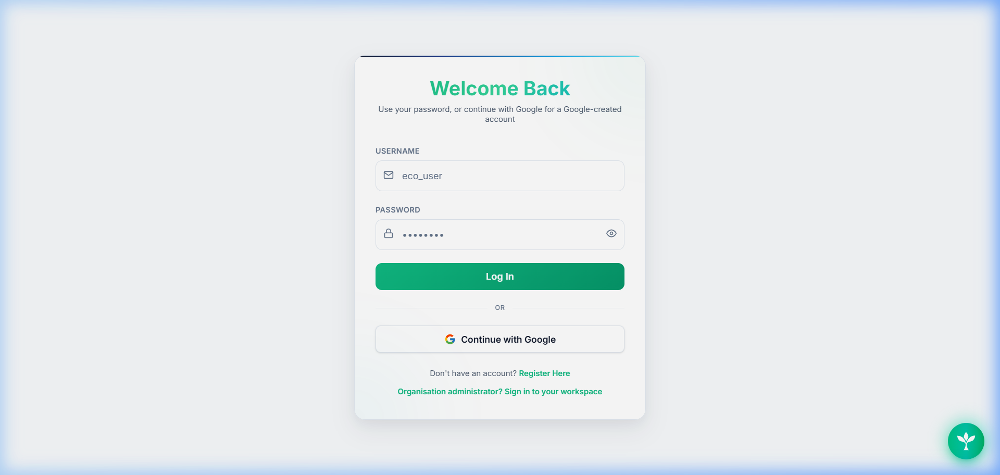
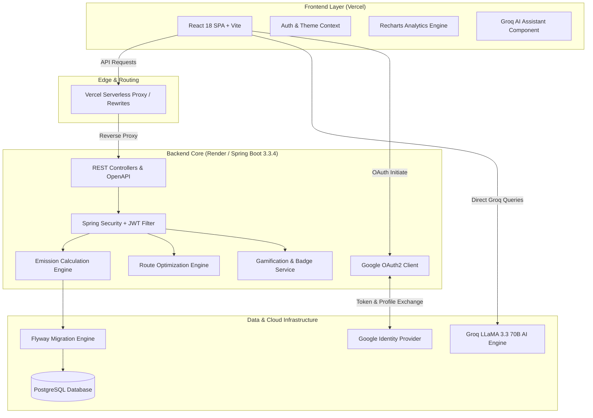

<div align="center">

# 🍀 CarbonTrack

**An Intelligent, Enterprise-Grade Carbon Footprint Tracking & Sustainability Intelligence Platform**

[](./LICENSE)
[](https://openjdk.org/)
[](https://spring.io/projects/spring-boot)
[](https://react.dev/)
[](https://vitejs.dev/)
[](https://tailwindcss.com/)
[](https://www.postgresql.org/)
[](https://carbon-track-beta.vercel.app/)

<p align="center">
  <a href="https://carbon-track-beta.vercel.app/">🌐 <strong>Explore Live App</strong></a> •
  <a href="#-features">✨ <strong>Key Features</strong></a> •
  <a href="#-system-architecture">🏗️ <strong>Architecture</strong></a> •
  <a href="#-quick-start">🚀 <strong>Quick Start</strong></a> •
  <a href="#-api-documentation">📖 <strong>API Docs</strong></a> •
  <a href="#-license">📄 <strong>License</strong></a>
</p>

</div>

---

## 📸 Website Preview

<div align="center">
  <h3>✨ Modern Landing & Eco Hub</h3>
  
</div>

<br/>

<div align="center">
  <table>
    <tr>
      <td width="50%" align="center">
        <h4>⚡ Interactive Features & Smart Insights</h4>
        
      </td>
      <td width="50%" align="center">
        <h4>📊 Eco Analytics & Capabilities</h4>
        
      </td>
    </tr>
    <tr>
      <td colspan="2" align="center">
        <h4>🔐 Seamless Authentication (Google OAuth2 + Stateless JWT)</h4>
        
      </td>
    </tr>
  </table>
</div>

---

## 🌟 Overview

**CarbonTrack** is a high-performance sustainability platform empowering individuals and enterprises to track, analyze, and systematically reduce greenhouse gas emissions ($CO_2e$). 

Powered by verified emission standard datasets (**EPA 2024** and **IPCC AR6**), CarbonTrack converts day-to-day transit, dining, energy consumption, and retail habits into verified footprint analytics, gamified streak badges, intelligent route optimization, and AI-driven reduction recommendations.

---

## ✨ Key Features

- 🌿 **Intelligent Emission Engine**: Real-time calculations across Transport (EV, Petrol, Flights, Public Transit), Electricity (Grid vs. Clean Solar/Wind), Diet (Vegan, Vegetarian, Meats), and Retail.
- 🤖 **Groq AI Eco-Advisor**: Contextual AI chatbot providing actionable emission reduction suggestions tailored to personal logs.
- 🚴 **Eco-Commute & Route Optimization**: Compare travel modes, multi-modal routes, and calculate net carbon savings per trip.
- 🏢 **Enterprise & CSR Portal**: Multi-tenant organization support, employee team leaderboards, department-level carbon tracking, and downloadable CSR compliance reports.
- 🏆 **Gamified Sustainability**: 15+ achievement tiers, streak trackers, badge levels (*Green Commuter*, *Clean Energy Pioneer*, *Zero Waste Champion*), and community leaderboards.
- 🔐 **Hybrid Authentication**: Google OAuth2 social login paired with high-entropy stateless HMAC-SHA256 JWT tokens.
- 📈 **Dynamic Visualization**: Responsive charts (Area, Bar, Radar, Donut) with Metric ($\text{kg CO}_2$) & Imperial ($\text{lb CO}_2$) unit conversion.

---

## 🏗️ System Architecture


```mermaid
graph TB
    subgraph "Frontend Layer (Vercel)"
        UI[React 18 SPA + Vite]
        CTX[Auth & Theme Context]
        CHART[Recharts Analytics Engine]
        AI_UI[Groq AI Assistant Component]
    end

    subgraph "Edge & Routing"
        VPROXY[Vercel Serverless Proxy / Rewrites]
    end

    subgraph "Backend Core (Render / Spring Boot 3.3.4)"
        SEC[Spring Security + JWT Filter]
        OAUTH[Google OAuth2 Client]
        CALC[Emission Calculation Engine]
        ROUTE[Route Optimization Engine]
        BADGE[Gamification & Badge Service]
        REST[REST Controllers & OpenAPI]
    end

    subgraph "Data & Cloud Infrastructure"
        PG[(PostgreSQL Database)]
        FLYWAY[Flyway Migration Engine]
        GROQ_API[Groq LLaMA 3.3 70B AI Engine]
        GOOGLE_ID[Google Identity Provider]
    end

    UI -->|API Requests| VPROXY
    VPROXY -->|Reverse Proxy| REST
    UI -->|Direct Groq Queries| GROQ_API
    UI -->|OAuth Initiate| OAUTH
    OAUTH <-->|Token & Profile Exchange| GOOGLE_ID
    REST --> SEC
    SEC --> CALC
    SEC --> ROUTE
    SEC --> BADGE
    CALC --> FLYWAY --> PG
```

---

## 🛠️ Tech Stack

### Frontend
| Technology | Description |
|---|---|
| **React 18** | High-performance UI library with modern hook architecture |
| **Vite 5.4** | Ultra-fast next-gen build tool & hot module replacement |
| **Tailwind CSS v4** | Modern utility-first CSS framework with fluid animations |
| **Recharts** | Composable declarative charting library |
| **React Router v6** | Declarative client-side routing with protected route guards |
| **Axios** | Interceptor-driven HTTP client for stateless JWT management |
| **React Toastify** | Elegant floating notification system |

### Backend
| Technology | Description |
|---|---|
| **Java 17 (LTS)** | Modern, secure Java runtime |
| **Spring Boot 3.3.4** | Standalone production-grade micro-framework |
| **Spring Security** | Stateless authentication, CSRF protections, and role-based ACLs |
| **Spring Data JPA** | Hibernate-powered persistence and query layer |
| **Flyway** | Versioned, reproducible database migrations |
| **PostgreSQL** | ACID-compliant relational cloud database |
| **Springdoc OpenAPI** | Automated interactive Swagger API documentation |
| **Lombok** | Compile-time boilerplate automation |

---

## 🚀 Quick Start

### Prerequisites
- **Java 17+** (JDK)
- **Node.js 18+** & **npm 9+**
- **Git**
- *(Optional)* **PostgreSQL** or in-memory **H2** (enabled by default in local mode)

---

### 1. Clone the Repository
```bash
git clone https://github.com/rakshitp18/CarbonTrack.git
cd CarbonTrack
```

---

### 2. Environment Configuration
Create a `.env` file in the root directory:

```env
# Database Configuration (PostgreSQL or local H2)
DB_HOST=localhost
DB_PORT=5432
DB_NAME=carbontrack_db
DB_USERNAME=postgres
DB_PASSWORD=your_password
CACHE_TYPE=simple

# Security Configuration
JWT_SECRET=ZmFrZS1kZXYtc2VjcmV0LWNoYW5nZS1tZS1pbi1wcm9kLTEyMzQ1Njc4OTA=
JWT_ACCESS_EXP_MS=3600000
JWT_REFRESH_EXP_MS=604800000

# Server
SERVER_PORT=8081

# Google OAuth2 (Optional for local development)
GOOGLE_CLIENT_ID=your-google-client-id
GOOGLE_CLIENT_SECRET=your-google-client-secret

# Groq AI Assistant
VITE_GROQ_API_KEY=your_groq_api_key
```

---

### 3. Backend Setup
```bash
cd backend
# Build and run with Maven Wrapper
./mvnw spring-boot:run
```
* Backend starts at `http://localhost:8081`
* Interactive Swagger Docs: `http://localhost:8081/swagger-ui.html`

---

### 4. Frontend Setup
```bash
cd ../frontend
npm install
npm run dev
```
* Frontend starts at `http://localhost:5173`

---

## 📖 API Documentation

When running locally, full interactive API documentation is available via Springdoc Swagger UI:

```
http://localhost:8081/swagger-ui.html
```

### Core API Endpoints
| HTTP Method | Path | Description | Access |
|---|---|---|---|
| `POST` | `/api/v1/auth/register` | Register new user account | Public |
| `POST` | `/api/v1/auth/login` | Authenticate & receive JWT token | Public |
| `GET` | `/api/v1/users/me` | Retrieve authenticated user profile | Authenticated |
| `POST` | `/api/v1/activities` | Log new carbon activity ($CO_2e$) | Authenticated |
| `GET` | `/api/v1/activities/history` | Fetch activity history & analytics | Authenticated |
| `GET` | `/api/v1/goals/active` | Get active carbon reduction goal | Authenticated |
| `GET` | `/api/v1/badges/my-badges` | Get earned badges & milestones | Authenticated |
| `GET` | `/api/v1/leaderboard` | View community leaderboards | Authenticated |
| `GET` | `/api/v1/organisations/dashboard`| Organization CSR analytics | Org Admin |

---

## 📁 Repository Structure

```
CarbonTrack/
├── backend/                   # Spring Boot Java Application
│   ├── src/main/java/         # Application source (Controllers, Services, Repositories)
│   ├── src/main/resources/    # Configs (application.yml, Flyway SQL migrations)
│   └── pom.xml                # Backend dependencies
│
├── frontend/                  # React Vite Single Page Application
│   ├── src/
│   │   ├── api/               # Axios client configuration
│   │   ├── components/        # Reusable UI components & AI widgets
│   │   ├── context/           # AuthContext & State management
│   │   ├── pages/             # Dashboard, Leaderboard, Analytics views
│   │   └── utils/             # OAuth & calculation helpers
│   ├── package.json           # Frontend dependencies
│   └── vite.config.js         # Vite configuration with proxy rules
│
├── docs/screenshots/          # High-resolution website preview assets
├── LICENSE                    # MIT License
└── README.md                  # Project documentation
```

---

## 📄 License

This project is licensed under the **MIT License** — see the [LICENSE](./LICENSE) file for details.

---

<div align="center">
  <sub>Built with 💚 by <strong>Team CarbonTrack</strong>. Empowering sustainable choices worldwide.</sub>
</div>
